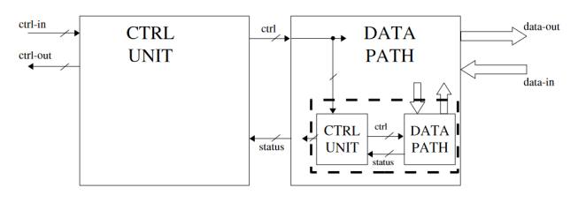
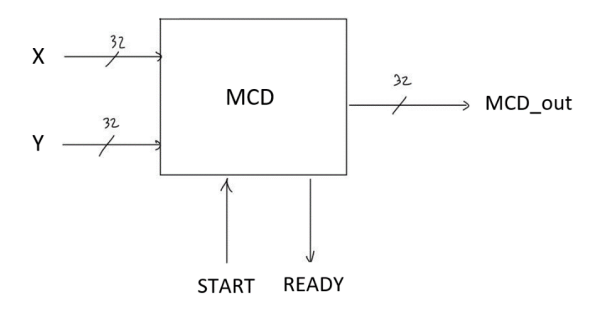
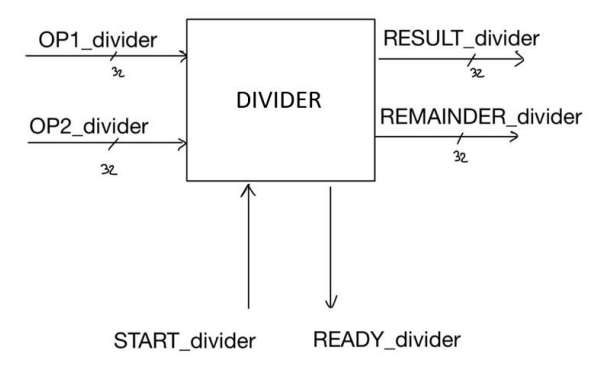

# MCD-device
In this project, we will present the design and simulation of a synchronous device in VHDL (at RT level) that calculates the greatest common divisor of two numbers. To achieve this, we will also design and simulate a sub-device (divisor) necessary for our purpose. Afterwards, we will synthesize the overall device for a Xilinx Spartan-6 FPGA.

**Note**: We have assumed that the calculation of the greatest common divisor between two values, one of which or both of which are zero, is never required, so the problem of division by zero is also avoided. As a result, we have not concerned ourselves with dealing with these particular cases in the analysis of algorithms.

# Design
For the design of a device that can be synthesized on a target circuit, we adopted the following workflow:

1. High-level algorithm design and simulation in C
2. Translation of the algorithm into ASM chart
3. Deduction of the Control Unit
4. Deduction of the Datapath
5. Completion of the Toplevel
6. Completion of the Testbench

The following photos represent the general scheme of the hierarchical design that we have adopted in which the subdevice is the DIVIDER while the main device is the MCD (both synthesizable):

